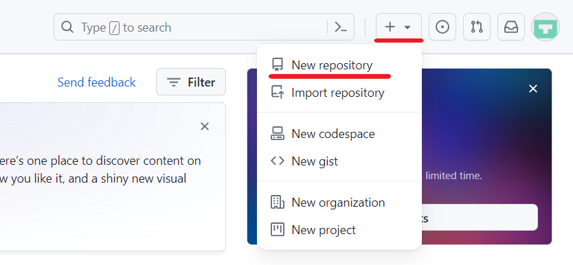
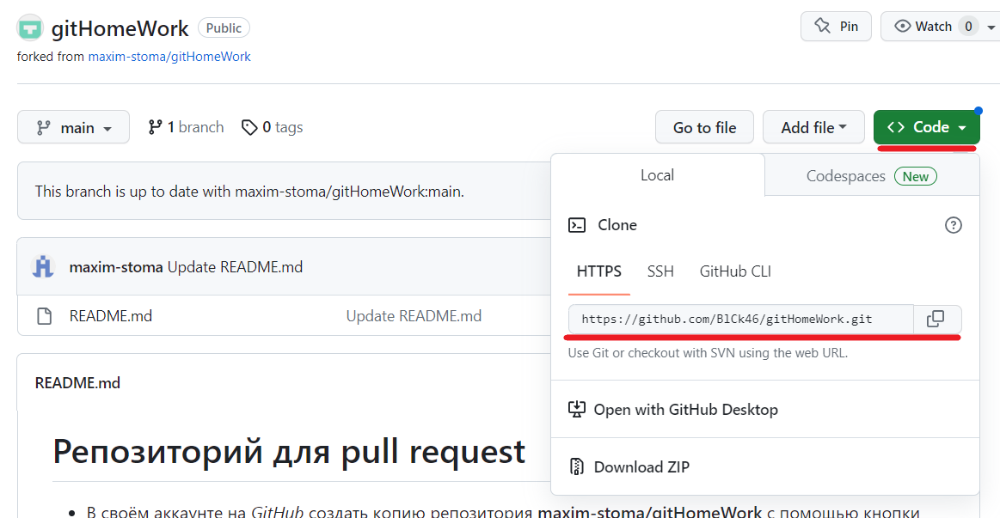

# Инструкция по работе с `Git`

## Начало работы

Для начала работы с Git необходимо “представиться” системе контроля версий, то есть объявить Ваше имя и Вашу электронную почту. Это поможет идентифицировать автора коммитов в репозиториях при дальнейшей работе.

### *Шаг 1: Конфигурация имени пользователя*

Откройте командную строку, Git Bash или терминал в VSCode, и выполните следующую команду, чтобы указать свое имя пользователя:

> git config --global user.name *"Your Name"*

Замените *"Your Name"* на ваше реальное имя пользователя (без кавычек). Эта информация будет использоваться в коммитах для указания автора изменений.

### *Шаг 2: Конфигурация адреса электронной почты*

Выполните следующую команду, чтобы указать свой адрес электронной почты:

> git config --global user.email *"your.email@example.com"*

Замените *"your.email@example.com"* на ваш действительный адрес электронной почты (без кавычек). Адрес электронной почты будет использоваться в коммитах для связи с автором изменений.

### *Шаг 3: Проверка настроек*

Вы можете выполнить команду

> git config --list

чтобы проверить ваши текущие настройки Git. Убедитесь, что ваше имя и адрес электронной почты правильно отображаются в списке (в самом конце выведенной на экран информации в терминале).

Также, чтобы проверить имя пользователя Git, выполните следующую команду в командной строке (или Git Bash):

> git config user.name

Эта команда выведет имя пользователя Git, которое было настроено в вашей системе. Если вывод пустой, это означает, что имя пользователя не было установлено.

Если вы хотите проверить глобальное имя пользователя (которое будет использоваться по умолчанию для всех репозиториев), добавьте флаг ***--global***:

> git config --global user.name

Если имя пользователя уже настроено, оно будет отображено в выводе команды.

Чтобы проверить адрес электронной почты пользователя Git, выполните следующую команду в командной строке (или Git Bash):

> git config user.email

Эта команда выведет адрес электронной почты, который был настроен для пользователя Git в вашей системе. Если вывод пустой, это означает, что адрес электронной почты не был установлен.

Если вы хотите проверить глобальный адрес электронной почты (который будет использоваться по умолчанию для всех репозиториев), добавьте флаг ***--global***:

> git config --global user.email

Если адрес электронной почты уже настроен, он будет отображен в выводе команды.

### *Шаг 4: Создание репозитория*

Теперь вы готовы к работе с Git локально на компьютере.

Для создания репозитория нужно пройти в папку проекта.

> #Для Linux и MacOS путь может выглядеть так */Users/UserName/Desktop/MyProject* 
>
>#Для Windows например *С://MyProject*
>
>> cd *<путь_к_вашему_проекту>*

> #Инициализация/создание репозитория
>
>> git init

Теперь Git отслеживает изменения файлов Вашего проекта. Но, так как вы только создали репозиторий в нем нет вашего кода. Для этого необходимо создать commit.

>#Добавим все файлы проекта в ваш будущий commit
>> git add .
>
>#Или так
>> git add --all
>
>#Если хотим добавить конкретный файл то можно так
>> git add *<имя_файла>* 
>
>#Теперь создаем commit. Обязательно указываем комментарий. И не забываем про кавычки
>> git commit -m *"<комментарий>"*

Отлично. Вы создали свой первый репозиторий и заполнили его первым commit.

## Базовые команды

* **git init** - инициализация локального репозитория
* **git status** - получить информацию от git о его текущем состоянии
* **git add** - добавить файл или файлы к следующему коммиту
* **git commit -m "message"** - создание коммита
* **git log** - вывод на экран истории всех коммитов с их хеш-кодами
* **git log --graph** - вывод на экран истории всех коммитов с их хеш-кодами и графиком
* **git checkout** - переход от одного коммита к другому 
* **git checkout master** - вернуться к актуальному состоянию и продолжить работу
* **git diff** - увидеть разницу между текущим файлом и закоммиченным файлом
* **git branch** - посмотреть список веток в репозитории
* **git branch branch_name** – создать новую ветку
* **git checkout branch_name** – переход к другой ветке  
* **git branch -d branch_name** – удалить ветку
* **git clone** *<url-адрес репозитория>* – клонирование внешнего репозитория на  локальный ПК 
* **git pull** – получение изменений и слияние с локальной версией 
* **git push** – отправляет локальную версию репозитория на внешний

## Работа с изображениями

Чтобы вставить изображение в текст, достаточно написать следующее:

>

## Работа с конфликтами при слиянии веток

При слиянии веток в Git возможны конфликты. Пример ниже:

При возникновении подобных ситуаций в Git имеется 3 варианта решения:

1. **Accept Current Change** - принять текущие изменения (*в файле остаются данные которые были до слияния веток*)
2. **Accept Incoming Change** - принять входящие изменения (*в файле удаляются данные которые были до слияния и добавляются данные из другой ветки*)
3. **Accept Both Changes** - принять оба изменения (*в файле остаются данные которые были до слияния и добавляются данные из другой ветки*)

## Работа с удаленными репозиториями

Для работы с удаленными репозиториями есть множество разных сервисов, но мы рассмотрим самый популярный - **`GitHub`**

После регистрации на GitHub, сервис может предложить нам 2 варианта начала работы с репозиториями:

1. Создать новый репозиторий
2. Скопировать уже готовый репозиторий

Рассмотрим их ниже:

### *1. Создание нового репозитория на GitHub*

Для создания нового репозитория нужно открыть вкладку с изображением знака (**+**) и нажать на *New Repositories* .

Дальше открывается страница с настройками нашего будущего репозитория:

* **Repository name** - название вашего репозитория. По нему другие пользователи смогут найти ваш репозиторий.

* **Description** - описание вашего репозитория.

* **Public/Private** - сделать ваш репозиторий *открытым* (любой в интернете сможет видеть его, но вы выбираете кто сможет коммитить его) или *приватным* (вы выбираете кто сможет видеть и коммитить ваш репозиторий).

* **Add a README file** - добавить в репозиторий файл *README*

* **Add .gitignore** - добавить в репозиторий файл *.gitignore*

* **Choose a license** - выбор лицензии

После создания репозитория GitHub сам предложит вам советы по настройке.
На выбор есть несколько вариантов команд:

1. Связать локальный репозиторий с удаленным
2. Создание нового репозитория через терминал
3. Открыть уже существующий проект через терминал
4. Импортировать проект из другого вер-сервиса хостинга IT-проектов

### *2. Копирование готового репозитория*

Работа с чужими репозиториями отличается от работы с собственными - вносить изменения в чужой нельзя, можно лишь предлогать свой вариант.

После того как вам предоставили ссылку или вы через поиск нашли нужный вам репозиторий, нужно скопировать его к себе на GitHub используя кнопку *Fork*. 

Кнопка *Fork* позволяет создать копию чужого репозитория, в которой вы можете свободно вносить изменения, а затем предложить их к внесению в исходный репозиторий.

Далее в уже созданной копии репозитория нужно получить его адрес. Открываем вкладку *Code* и копируем URL адресс.

Осталось загрузить его через терминал использовав команду:

> **git clone <URL_адресс>**

После внесения всех необходимых изменений в скопированном репозитории нужно выполнить следующую команду:

> **git push**

Если вы работаете над чужим проектом, то после ввода команды **git push** терминал вам подскажет что был создан некий запрос - *Pull request*

Вернувшись в свой скопируемый репозиторий, вы обнаружите поле с данной кнопкой. 

Данная кнопка предлагает отправить вашу модификацию автору этого проекта. Так же в запросе отображены все ваши изменения.

# Редактирование текста в Markdown

## Полужирное и курсивное начертания

Чтобы задать для текста **полужирное начертание**, заключите его в двойные звездочки:
> This text is **\*\*bold\*\***.

Чтобы задать для текста *курсивное начертание*, заключите его в одинарные звездочки:
> This text is *\*italic\**.

Чтобы задать для текста ***полужирное и курсивное начертание***, заключите его в тройные звездочки:
> This text is both ***\*\*\*bold and italic\*\*\****.

## Нумерованный список

Для создания нумированного списка используйте цифры, за которыми следует точка и пробел в начале каждой строки:
> 1. This is
> 2. a numbered list 

## Маркированный список

Для создания маркированного списка используйте **\-** или **\***, за которым следует пробел в начале каждой строки:
> - This is
> - a parent bulleted list
>    - and this is
>    - a nested bulleted list
> - All done!

## Блок цитирования

Блоки цитирования создаются с помощью символа **>** :
> \> This is a blockquote. It is usually rendered indented and with a different background color. 

